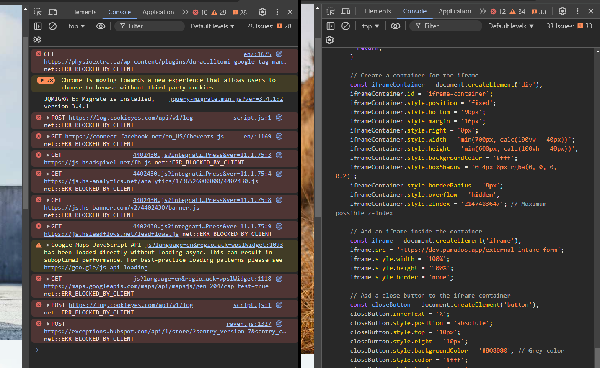
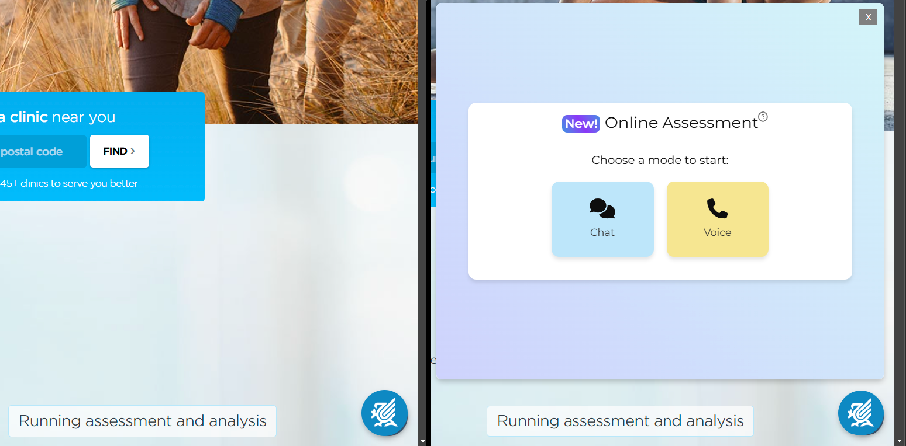

# Parados Intake Form Button Demo

This project demonstrates how a Parados intake form can be seamlessly integrated into any website. With this script, you can create a floating button on the bottom-right corner of a webpage. Clicking the button opens a popup showcasing the client intake form, providing a clear example of how the form would look when embedded in a client's website.

---

## Features

- **Floating Button**: Positioned at the bottom-right corner of the page.
- **Popup with Form**: Opens a 700px x 600px (or responsive max-width/height) iframe containing the intake form.
- **Customizable Look**: Styled with Parados branding for demos.
- **Easy Integration**: Works by simply copying the provided script into a browser console.

---

## Prerequisites

- A basic understanding of using browser developer tools (console).
- Access to this repository.

---

## Instructions

### 1. Copy the Script

1. Navigate to the repository folder and locate the `script.js` file.
2. Open the file and copy its content. This is the JavaScript code needed to create the button and popup.

---

### 2. Open the Browser Console

1. Open any website in your browser where you want to demo the form.
2. Press `F12` or `Ctrl+Shift+I` (Windows/Linux) or `Cmd+Opt+I` (Mac) to open the **Developer Tools**.
3. Click on the **Console** tab.

---

### 3. Paste the Script

1. Paste the copied script into the console.
2. Press `Enter`.

---

### 4. View the Result

- A circular button will appear in the bottom-right corner of the webpage.
- Clicking the button opens the Parados client intake form in a popup.

